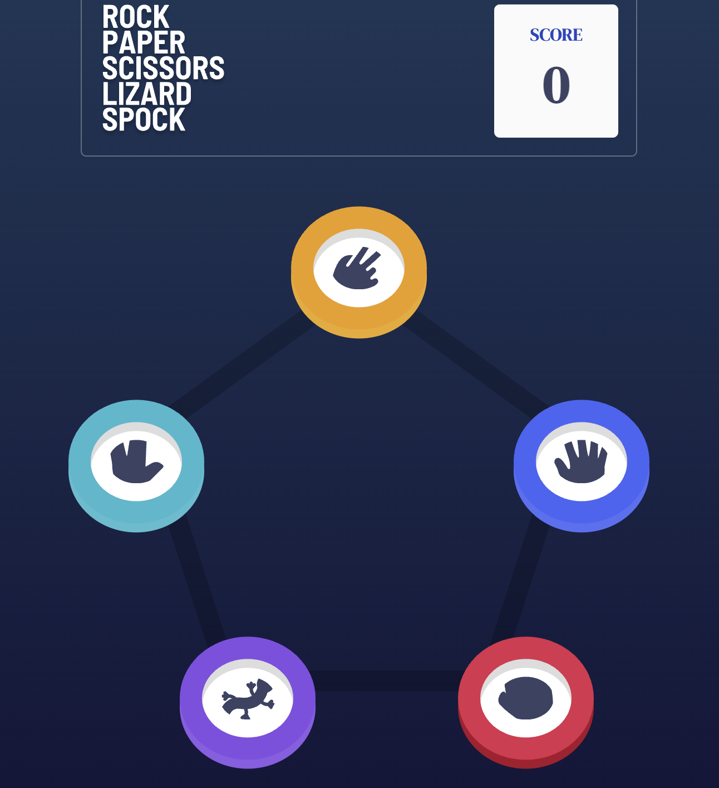

# Frontend Mentor Challenge- Rock, Paper, Scissors solution

This is a solution to the [Rock, Paper, Scissors challenge on Frontend Mentor](https://www.frontendmentor.io/challenges/rock-paper-scissors-game-pTgwgvgH). Frontend Mentor challenges help you improve your coding skills by building realistic projects.

Users should be able to:

- View the optimal layout for the game depending on their device's screen size
- Play Rock, Paper, Scissors against the computer
- **Bonus**: Play Rock, Paper, Scissors, Lizard, Spock against the computer

### Screenshot

### Links

- Solution URL: [Add solution URL here](https://github.com/agathayin/agathayin.github.io/rock-paper-scissors-master)
- Live Site URL: [Add live site URL here](https://agathayin.github.io/rock-paper-scissors-master)

## My process

### Built with

- Semantic HTML5 markup
- CSS custom properties
- CSS Grid
- CSS animation
- JavaScript
- jQuery

### Useful resources

- [CSS Grid and Custom Shapes](https://css-tricks.com/css-grid-and-custom-shapes-part-1/) - This help me with the gallery shape. The examples of grid of hexagons and rhombuses look fancy. I also leant a lot about the css variables, clip-path, and aspect-ratio, which is useful for avatar images.

some resources for animation

- [Simple CSS animation for "fade in" on page load](https://dev.to/tiaeastwood/super-simple-css-animation-for-fade-in-on-page-load-2p8m)
- [animation](https://css-tricks.com/almanac/properties/a/animation/)
- [39 Awesome CSS Animation Examples with Demos + Live Code](https://prismic.io/blog/css-animation-examples)
- [Creating Glow Effects with CSS](https://codersblock.com/blog/creating-glow-effects-with-css/)

### Continued development

I shall probably use sessionStorage to remember the score after refreshing the page.

I also plan to improve the animation.
